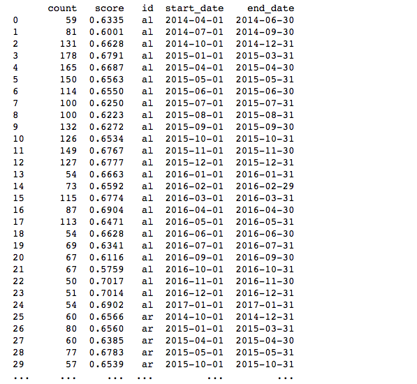

###How to access ESS data via Python
####Steps
1. Import relevant libraries (`json`, `pandas`, `requests`)     
2. Request the data from ESS API using `requests.get()`   
3. Import the JSON data using .json()
4. Convert data to a dataframe using `pandas.DataFrame()` 

```python
import json   # to deal with json objects
import pandas as pd # to convert to dataframe and complete analysis
import requests # to make http request


url = "https://data.thumbtack.com/v1/sentiments/states"
sentiment_states = requests.get(url)
sentiment_states.status_code # check that status code is OK (200)
sentiment_states.headers # check the content-type this response; confirm that it's type json
sentiment_states_data = sentiment_states.json() # import json data
print(sentiment_states_data['data'])  # check the data
```
          
     

Convert json data to a dataframe      
```python        
sentiment_states_df = pd.DataFrame(sentiment_states_data['data'], columns= ['count', 'score', 'id', 'start_date', 'end_date'])

print(sentiment_states_df)
```      
       
          
The sentiments data is now ready for analysis!        
          
#####Dealing with Nested Lists
The question scores data needs some restructuring for analysis. Take a look at the `scores` column in the the dataframe below: 
```python
url2 = "https://data.thumbtack.com/v1/question-scores"
question_scores = requests.get(url2)
question_scores.status_code
question_scores.headers
question_scores_data = question_scores_data.json()

question_scores_df = pd.DataFrame(question_scores_data, columns= ['id', 'levels', 'scores', 'start_date', 'end_date'])
question_scores_df.head() 
```

                  
            
Notice how the column `scores` is a list of dictionaries with key values `level` and `score`. We want to restructure the data so that each field is its own column in a dataframe:

```python
new_qs_data = {'id': [], 'start_date': [], 'end_date': [], 'level' : [], 'score' : []}

for i in question_scores_data['data']:

    id_vals = i['id']
    start_date_vals = i['start_date']
    end_date_vals = i['end_date']
    
    for j in i['scores']:
        level_vals = j['level']
        score_vals = j['score']

        new_qs_data['level'].append(level_vals)   
        new_qs_data['score'].append(score_vals)
        
        new_qs_data['id'].append(id_vals)
        new_qs_data['start_date'].append(start_date_vals)
        new_qs_data['end_date'].append(end_date_vals)

print new_qs_data
```
  

```python
testing_df2 = pd.DataFrame(new_qs_data) # convert dictionary to dataframe
print testing_df2.head() # preview dataframe
```
  
We now have the structure we want. The final step is to reorder the columns if needed.      

```python
testing_df3 = testing_df2[['id', 'level', 'score', 'start_date', 'end_date']] # reorder dataframe columns
print(testing_df3.head()) # preview updated dataframe
```

  

And now the question scores data is ready to be further analyzed in Python!
